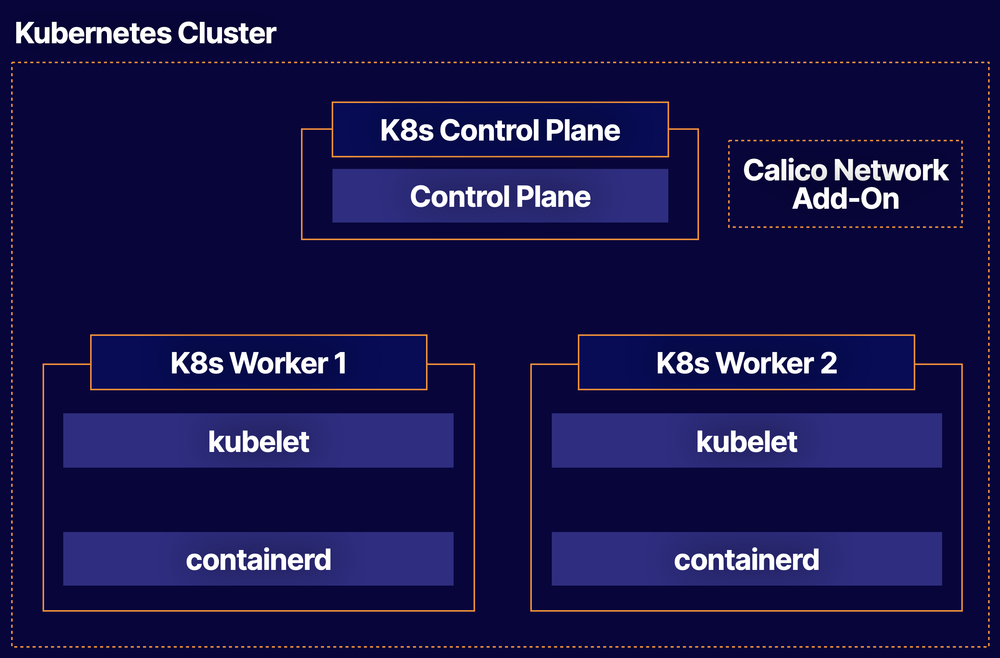

## Scenerio:

Your company wants to transition to a Kubernetes-based infrastructure for running their containerized applications. In order to do that, they will need a basic Kubernetes cluster to get started.

You have been provided with three servers. Build a simple Kubernetes cluster with one `control plane node` and `two worker nodes`.

1. Install and use `kubeadm` to build a Kubernetes cluster on these servers.

2. Install Kubernetes version 1.27.0.

3. Use containerd for your container runtime.

4. The cluster should have one control plane node and two worker nodes.

5. Use the Calico networking add-on to provide networking for the cluster.

* Note: If you would like the lab setup to be the same as the CKA "Building a Kubernetes Cluster" lesson, you can also set the hostnames for each node with command `sudo hostnamectl set-hostname [k8s-control | k8s-worker1 | k8s-worker2]`. You would then place the three entries in each node's hosts file with `sudo vi /etc/hosts`. The hosts file should contain the private IP of each node along with its corresponding hostname.

