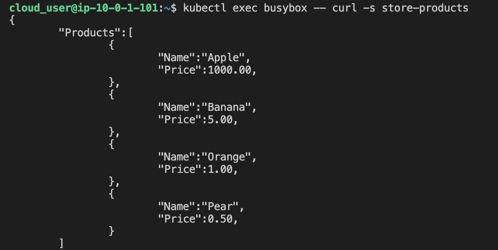

1. Login into the kube node master

2. Create a deployment
```
kubectl apply -f store-pdts.yaml

kubectl get deploy

kubectl get pods
```

3. Create a service
```
kubectl apply -f store-pdts-svc.yaml

kubectl get svc
```

4. Validate that other pods can access the newly created pods via its service
```
kubectl exec busybox -- curl -s {svc-name}/{svc-cluster-IP}
```

