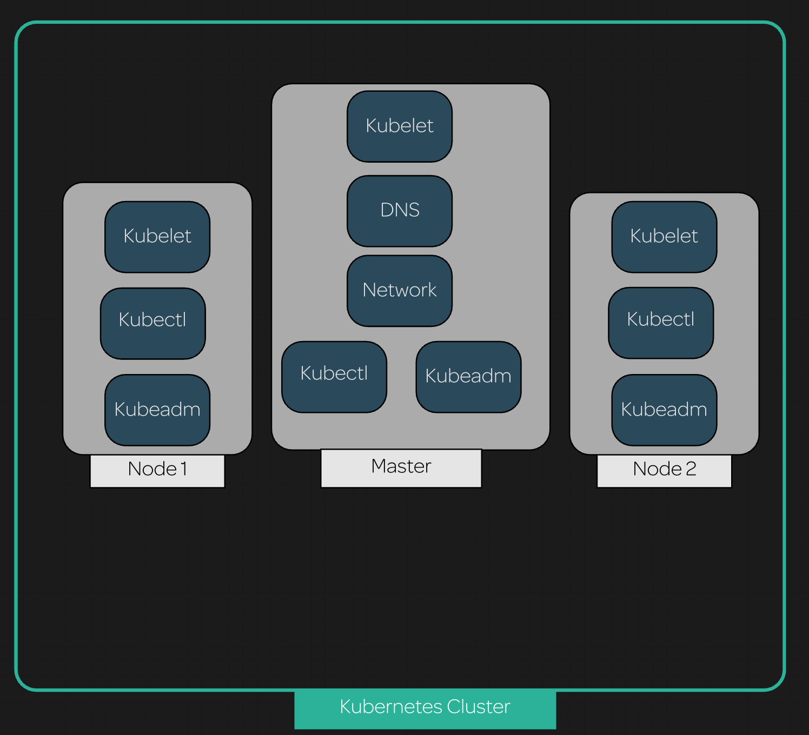

## Scenerio:

In this hands-on lab, we will install and configure a Kubernetes cluster consisting of 1 master and 2 nodes. Once the installation and configuration are complete, we will have a 3-node Kubernetes cluster that uses Flannel as the network overlay.

