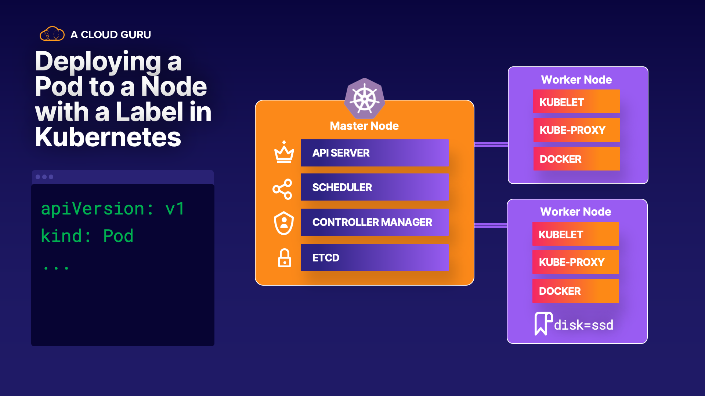

## Scenerio:

You have been tasked with creating a pod named `nginx`, which needs to use the `nginx image`. This pod needs to run on a node that has solid state drives (SSD). 
Luckily, the nodes have already been labeled with the disk type. You must find the node with the label `disk=ssd` from within the provided Kubernetes cluster. Then, you will create the pod YAML which will force the pod to use the node with that label. Finally, you will apply the YAML to the Kubernetes cluster and verify that the pod is running on the correct node.

### Task:

1. List the labels for all nodes in the cluster

2. Create the pod YAML that will choose to run on the node labeled `disk=ssd`

3. Apply the YAML to the Kubernetes cluster

4. Verify that the pod is running on the correct node

For more information on creating static pod, see: `https://kubernetes.io/docs/tasks/configure-pod-container/static-pod/`

