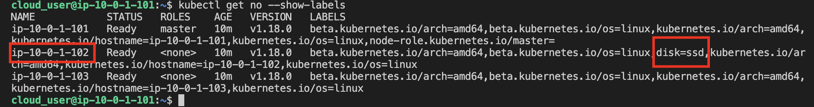
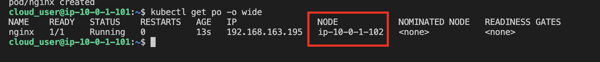

1. Log in to the Kube Master server.

2. List all the nodes in the cluster
```
kubectl get nodes
```

* There should be three nodes: one master and two workers.

3. List all the pods in all namespaces.
```
kubectl get pods --all-namespaces
```

4. List all the namespaces in the cluster.
```
kubectl get namespaces
```

* Here, there should be four namespaces: `default, kube-public, kube-system, and kube-node-lease`.

5. Check to see if there are any pods running in the default namespace.
```
kubectl get pods
```

6. Find the IP address of the API server running on the master node.
```
kubectl get pods --all-namespaces -o wide
```

7. List the labels for all nodes in the cluster
```
kubectl get no --show-labels
```

* One of the nodes will have the label `disk=ssd`



8. Create the pod YAML that will run on the node labeled `disk=ssd`

Apply the YAML file to the Kubernetes cluster
```
kubectl apply -f pod.yaml
```

9. Verify that the pod is running on the correct node
```
kubectl get po -o wide
```

