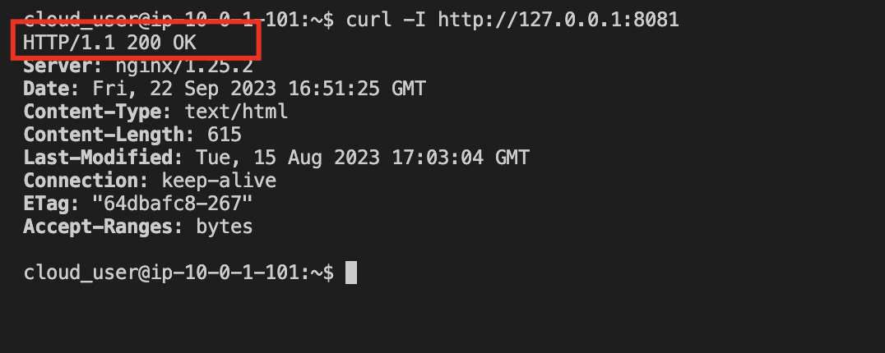
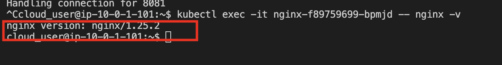
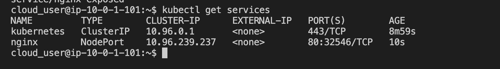
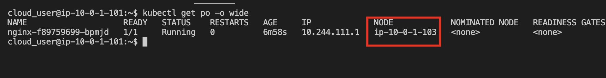
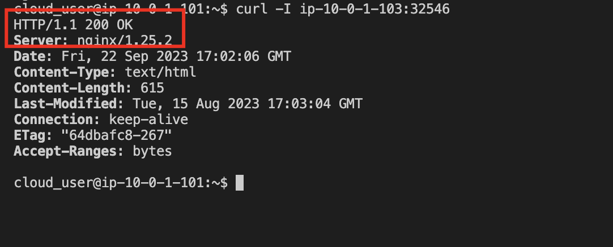

1. Log in to all three servers.

2. Get the Docker gpg, and add it to your repository.

* In all three terminals, run the following command to get the Docker gpg key
```
curl -fsSL https://download.docker.com/linux/ubuntu/gpg | sudo apt-key add -
```

* Then add it to your repository
```
sudo add-apt-repository "deb [arch=amd64] https://download.docker.com/linux/ubuntu $(lsb_release -cs) stable"
```

3. Get the Kubernetes gpg key, and add it to your repository.

* In all three terminals, run the following command to get the Kubernetes gpg key
```
curl -s https://packages.cloud.google.com/apt/doc/apt-key.gpg | sudo apt-key add -
```

* Then add it to your repository
```
cat << EOF | sudo tee /etc/apt/sources.list.d/kubernetes.list
deb https://apt.kubernetes.io/ kubernetes-xenial main
EOF
```

* Update the packages
```
sudo apt update
```

4. Install Docker, kubelet, kubeadm, and kubectl.

* In all three terminals, run the following command to install Docker, kubelet, kubeadm, and kubectl
```
sudo apt install -y docker-ce=5:19.03.10~3-0~ubuntu-focal kubelet=1.18.5-00 kubeadm=1.18.5-00 kubectl=1.18.5-00
```

5. Initialize the Kubernetes cluster.

1. In the Controller (master node) server terminal, run the following command to initialize the cluster using kubeadm
```
sudo kubeadm init --pod-network-cidr=10.244.0.0/16
```

6. Set up local kubeconfig.

* In the Controller server terminal, run the following commands to set up local kubeconfig
```
sudo mkdir -p $HOME/.kube

sudo cp -i /etc/kubernetes/admin.conf $HOME/.kube/config

sudo chown $(id -u):$(id -g) $HOME/.kube/config
```

7. Apply the flannel CNI plugin as a network overlay.

* In the Controller server terminal, run the following command to apply flannel
```
kubectl apply -f https://docs.projectcalico.org/v3.14/manifests/calico.yaml
```

8. Join the worker nodes to the cluster, and verify they have joined successfully.

* Run `sudo kubeadm init` on the Controller node, copy the `kubeadmin join ...` in the output.

* Join any number of machines by running the following on each node as root
```
sudo kubeadm join ...
```

9. Run a deployment that includes at least one pod, and verify it was successful.

* In the Controller server terminal, run the following command to run a deployment of ngnix
```
kubectl create deployment nginx --image=nginx
```

* Verify its success
```
kubectl get deployments
```

10. Verify the pod is running and available.

* In the Controller server terminal, run the following command to verify the pod is up and running
```
kubectl get pods
```

11. Use port forwarding to extend port `80 to 8081`, and verify access to the pod directly.

* In the Controller server terminal, forward the container port 80 to 8081
```
kubectl port-forward {pod_name} 8081:80
```

12. Open a new terminal session and log in to the Controller server. Then, verify access to the container directly
```
curl -I http://127.0.0.1:8081
```



13. Execute a command directly on a pod.

* In the original Controller server terminal, hit Ctrl+C to exit out of the running program.

* Still in Controller, execute the nginx version command from a pod
```
kubectl exec -it {pod_name} -- nginx -v
```



14. Create a service, and verify connectivity on the node port.

* In the original Controller server terminal, create a NodePort service
```
kubectl expose deployment nginx --port 80 --type NodePort
```

* View the service
```
kubectl get services
```



15. Get the node the pod resides on.
```
kubectl get po -o wide
```



16. Verify the connectivity by using curl on the NODE and the port from the service.
```
curl -I YOUR_NODE:YOUR_PORT
```

