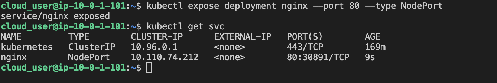
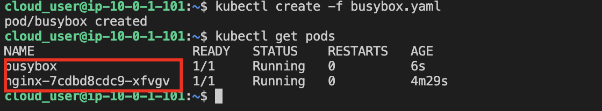
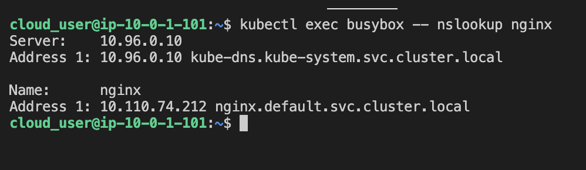
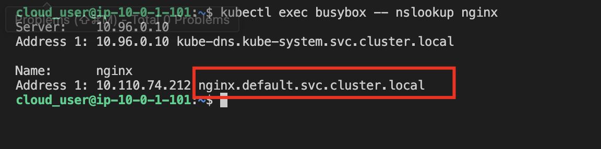

1. Log in to the Kube Master server.

2. Create an nginx deployment, and verify it was successful.
```
kubectl run nginx --image=nginx

kubectl get deployments
```

3. Create a service, and verify its success.
```
kubectl expose deployment nginx --port 80 --type NodePort

kubectl get services
```



4. Create a pod that will allow you to query DNS, and verify it’s been created.
```
kubectl create -f busybox.yaml

kubectl get pods
```



5. Perform a DNS query to the nginx service.
```
kubectl exec busybox -- nslookup nginx
```



Record the DNS name.
```
[service-name].default.svc.cluster.local
```

