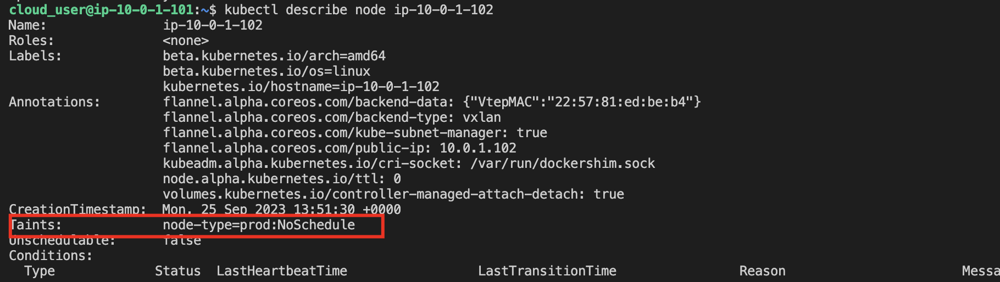

1. SSH into the master node

2. Taint one of the worker nodes to repel work.
```
kubectl get nodes

kubectl taint node <NODE_NAME> node-type=prod:NoSchedule
```



3. Schedule a pod to the dev environment by creating dev-pod.yaml file
```
vim dev-pod.yaml

kubectl create -f dev-pod.yaml
```

4. Schedule a pod to the prod environment.
Create the prod-deployment.yaml file:
```
vim prod-deployment.yaml

kubectl create -f prod-deployment.yaml
```

5. Verify each pod has been scheduled to the correct environment.
```
kubectl get pods -o wide
```

6. Scale up the deployment
```
kubectl scale deployment/prod --replicas=3

kubectl get pods -o wide
```
* Note: Two more pods would have been deployed in the node with toleration.