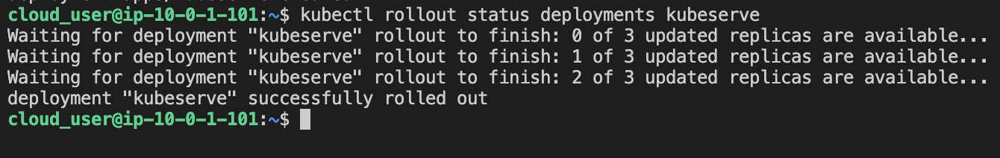
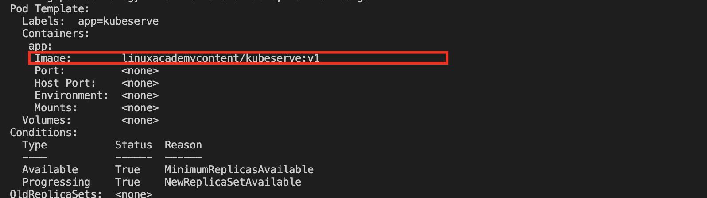
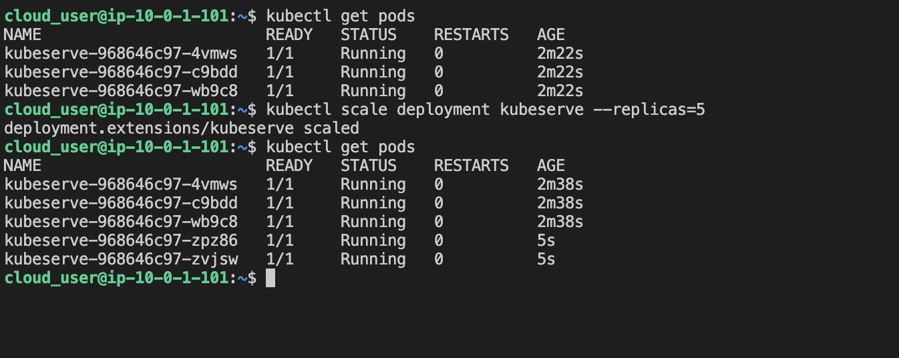
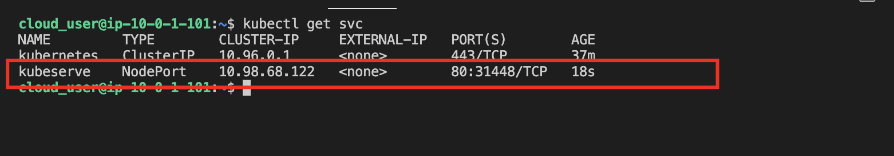
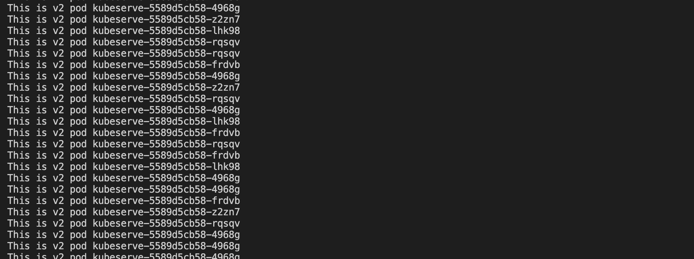
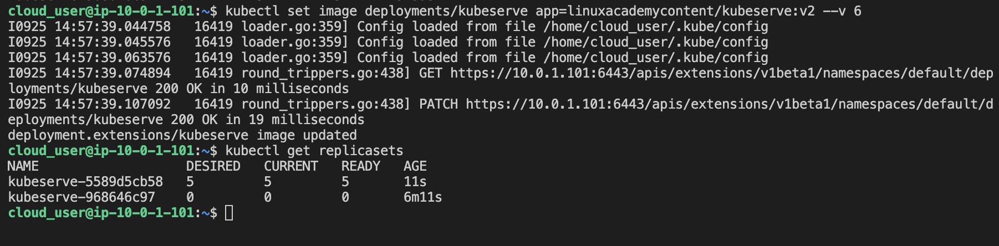
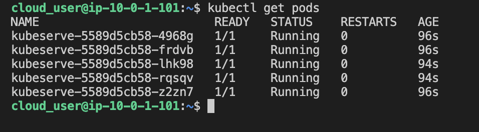
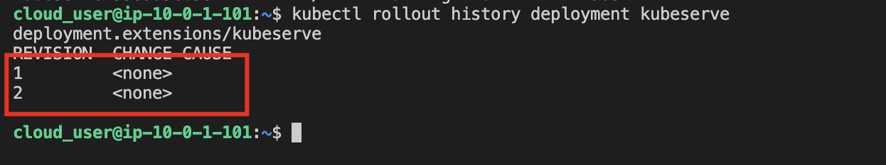

1. Log in to the Kube Master server, check for a working cluster
```
kubectl get nodes
```

2. Create and Roll Out Version 1 of the Application, and Verify a Successful Deployment

* Create a deployment
```
vim kubeserve-deployment.yaml

kubectl apply -f kubeserve-deployment.yaml
```

* Verify the deployment was successfully rolled out. 
```
kubectl rollout status deployments kubeserve
```



* Verify the app is at the correct image version (v1)
```
kubectl describe deployment kubeserve
```



3. Scale Up the Application to Create High Availability

* Verify pods (3)
```
kubectl get pods
```

* Scale up the application to 5 replicas, then validate.
```
kubectl scale deployment kubeserve --replicas=5

kubectl get pods
```



4. Create a Service So Users Can Access the Application
```
kubectl expose deployment kubeserve --port 80 --target-port 80 --type NodePort

kubectl get services
```



5. Perform a Rolling Update to Version 2 of the Application, and Verify Its Success

* Start another terminal session logged in to the same Kube Master server. Use the `curl loop command` to see the version change as you perform the rolling update.

```
while true; do curl http://<ip-address-of-the-service>; done
```



* Perform an update in the original terminal session (while the curl loop is running in the second terminal session)
```
kubectl set image deployments/kubeserve app=linuxacademycontent/kubeserve:v2 --v 6
```

* * In the second terminal session, you should see v2 of the pod displayed in the output.

* In the first terminal, view the additional ReplicaSet created during the update
```
kubectl get replicasets
```



* Verify all 5 pods are up and running
```
kubectl get pods
```



* View the rollout history
```
kubectl rollout history deployment kubeserve
```

