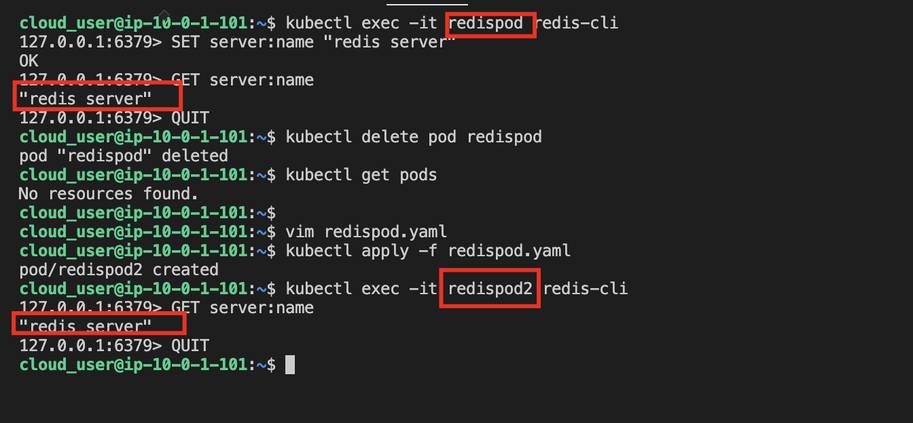

1. Log in to the Kube Master server.

2. Create a PersistentVolume.
```
vim redis-pv.yaml

kubectl apply -f redis-pv.yaml
```

3. Create a PersistentVolumeClaim.
```
vim redis-pvc.yaml

kubectl apply -f redis-pvc.yaml
```

4. Create a pod from the redispod image, with a mounted volume to mount path `/data`.
```
vim redispod.yaml

kubectl apply -f redispod.yaml

kubectl get pods
```

5. Connect to the container and write some data.

* Connect to the container and run the redis-cli:
```
kubectl exec -it redispod redis-cli
```

* Set the key space server:name and value "redis server":
```
SET server:name "redis server"
```

* Run the GET command to verify the value was set:
```
GET server:name
```

* Exit the redis-cli: `QUIT`

6. Delete redispod and create a new pod named redispod2.
```
kubectl delete pod redispod

{After changing name from redispod to redispod2}

kubectl apply -f redispod.yaml
```

7. Verify the volume has persistent data.
```
kubectl exec -it redispod2 redis-cli

GET server:name

QUIT
```

