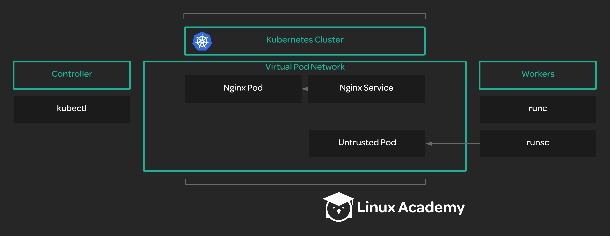

## Scenerio:

Your team has just finished setting up a new Kubernetes cluster. But before moving your company’s online store to the cluster, they want to make sure that the cluster is set up correctly. The team has asked you to run a series of smoke tests against the cluster in order to make sure that everything is working.

You can complete the steps for this activity on the controller server, so get logged into the controller.

## Tasks:

* Verify the cluster's ability to perform data encryption.

* Verify that deployments work.

* Verify that remote access works via port forwarding.

* Verify that you can access container logs with `kubectl logs`.

* Verify that you can execute commands inside a container with `kubectl exec`.

* Verify that services work.

