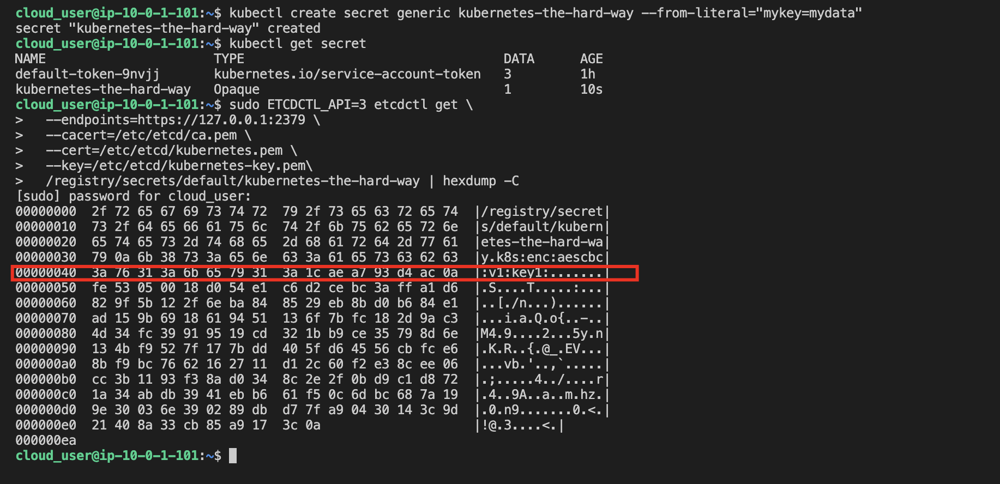
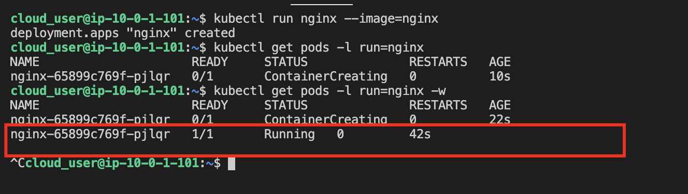
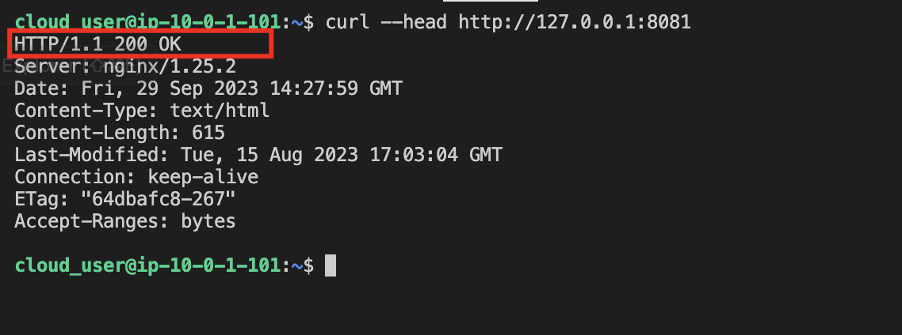
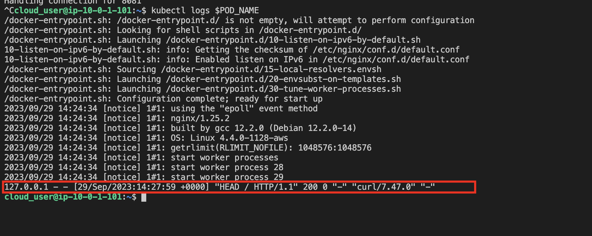
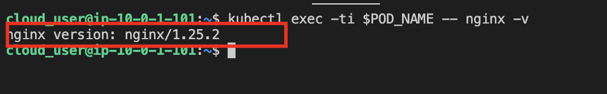
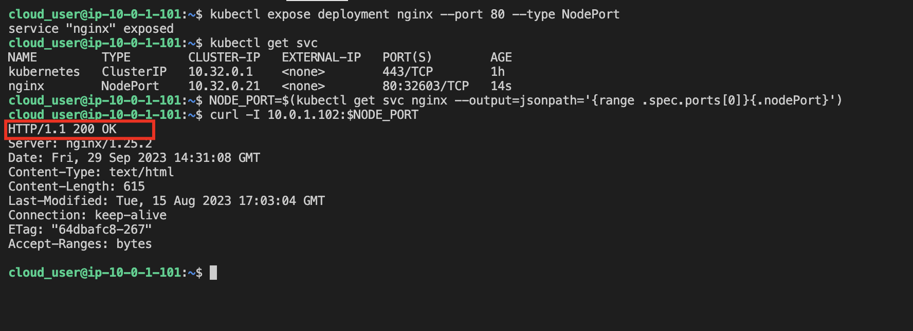

* SSH into the Controller Server

## Verify the Cluster's Ability to Perform Data Encryption

* Create some sensitive data and verify it is stored in an encrypted format.
```
kubectl create secret generic kubernetes-the-hard-way --from-literal="mykey=mydata"
```

* Get the raw data from etcd
```
sudo ETCDCTL_API=3 etcdctl get \
  --endpoints=https://127.0.0.1:2379 \
  --cacert=/etc/etcd/ca.pem \
  --cert=/etc/etcd/kubernetes.pem \
  --key=/etc/etcd/kubernetes-key.pem\
  /registry/secrets/default/kubernetes-the-hard-way | hexdump -C
```

* Validate `k8s:enc:aescbc:v1:key1` on the right of the output to verify the data is stored in an encrypted format.



## Verify that Deployments Work

* Create a new deployment
```
kubectl run nginx --image=nginx
```

* Verify the deployment created a pod and that the pod is running
```
kubectl get pods -l run=nginx
```

* The pod should be in the `Running STATUS` with `1/1` containers READY.



## Verify Remote Access Works via Port Forwarding

* Get the pod name of the nginx pod and store it as an environment variable
```
POD_NAME=$(kubectl get pods -l run=nginx -o jsonpath="{.items[0].metadata.name}")
```

* Forward port 8081 to the nginx pod
```
kubectl port-forward $POD_NAME 8081:80
```

* Open up a new terminal, log in to the controller server, and verify the port forward works
```
curl --head http://127.0.0.1:8081
```

* There should be an `http 200 OK` response from the nginx pod.

* Stop the port-forward in the original terminal with `CTRL+C`.



## Verify Access to Container Logs with `kubectl logs`

* Get the logs from the nginx pod
```
kubectl logs $POD_NAME
```

* Verify the output
```
127.0.0.1 - - [10/Sep/2018:19:29:01 +0000] "GET / HTTP/1.1" 200 612 "-" "curl/7.47.0" "-"
```



## Verify Execution Commands Inside a Container with `kubectl exec`

* Execute a simple nginx -v command inside the nginx pod
```
kubectl exec -ti $POD_NAME -- nginx -v
```

* Verify output
```
nginx version: nginx/1.15.3
```



## Verify Services Works

* Create a service to expose the nginx deployment
```
kubectl expose deployment nginx --port 80 --type NodePort
```

* Get the node port assigned to the newly created service and assign it to an environment variable
```
NODE_PORT=$(kubectl get svc nginx --output=jsonpath='{range .spec.ports[0]}{.nodePort}')
```

* Access the service on one of the worker nodes from the controller (10.0.1.102 is the private IP of one of the workers):
```
curl -I 10.0.1.102:$NODE_PORT
```

* You should get an `http 200 OK` response.

