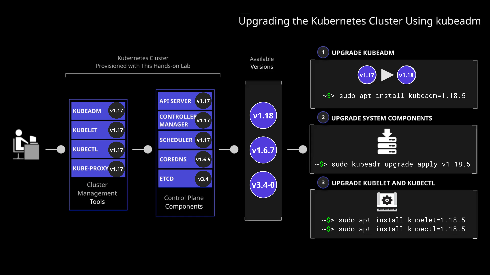

## Scenerio:

Log in to each of the Kubernetes nodes and work through the objectives list.

1. Install Version 1.18.5 of kubeadm on Master Node

2. Upgrade Control Plane Components using kubeadm

3. Install Version 1.18.5 of kubelet on Master Node

4. Install Version 1.18.5 of kubectl on Master Node

5. Install Version 1.18.5 of kubelet on The Worker Nodes

