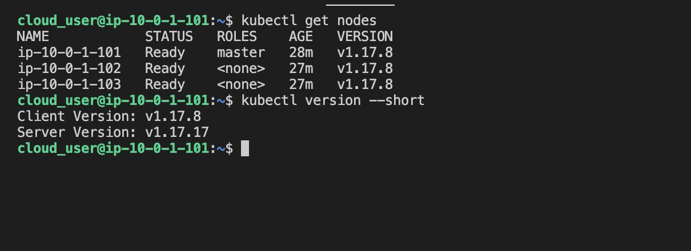
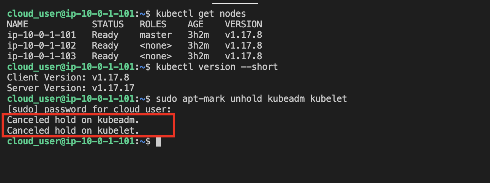
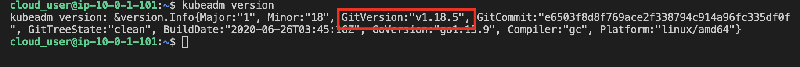
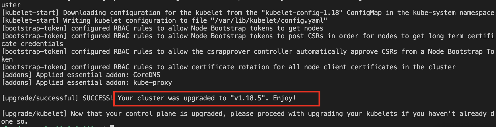
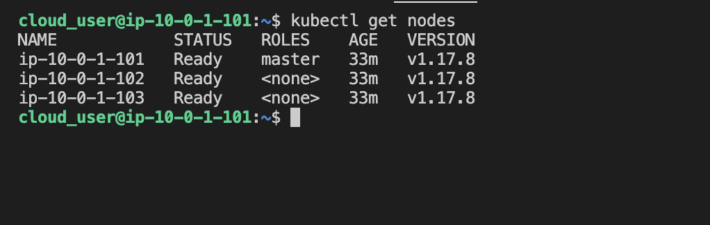
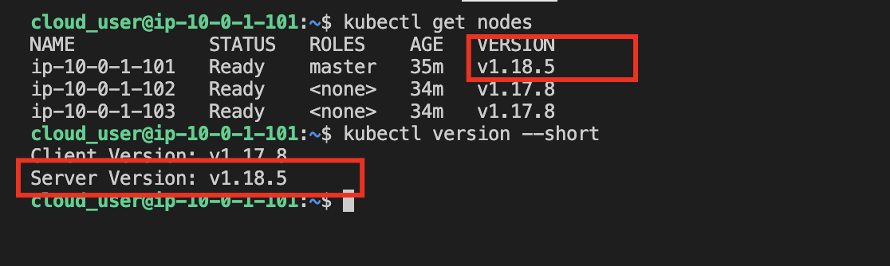
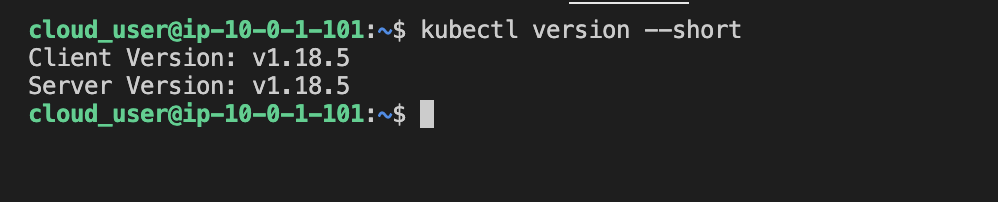
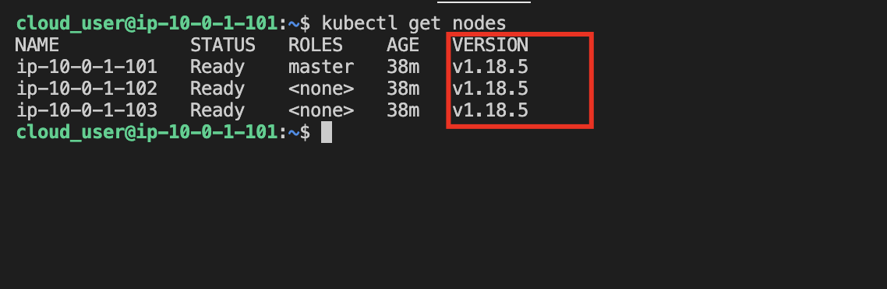

* Log in to the master node server and worker nodes

### Install Version 1.18.5 of kubeadm
1. On the master node, check the current version of kubeadm, then check for the Client Version and Server Version
```
kubectl get nodes
kubectl version --short
```



2. Take the hold off of kubeadm and kubelet
```
sudo apt-mark unhold kubeadm kubelet
```



3. Install them using the package manager, and check the version again (which should show v1.18.5)
```
sudo apt install -y kubeadm=1.18.5-00

kubeadm version
```



4. Plan the upgrade to check for errors
```
sudo kubeadm upgrade plan
```

5. Apply the upgrade of the kube-scheduler and kube-controller-manager
```
sudo kubeadm upgrade apply v1.18.5 -y
```



6. Check nodes version
```
kubectl get nodes
```



### Install the Latest Version of kubelet on the Master Node

1. Ensure kubelet package isn't on hold
```
sudo apt-mark unhold kubelet
```

2. Install the latest version of kubelet
```
sudo apt install -y kubelet=1.18.5-00
```

3. Verify successful installation
```
kubectl get nodes
```

* Note: This should show that the master node is on `v1.18.5`, but the two worker nodes are still at `v1.17.8`. Run `kubectl version --short` again, to see the `Server Version` is `v1.18.5`, and the `Client Version` is at `v1.17.8`.



### Install the Latest Version of kubectl on the Master Node

1. Ensure kubectl package isn't on hold:
```
sudo apt-mark unhold kubectl
```

2. Install the latest version of kubectl
```
sudo apt install -y kubectl=1.18.5-00
```

3. Verify successful installation
```
kubectl version --short
```



### Install the Newer Version of kubelet on the Worker Nodes

1. On Worker 1

* Ensure kubelet package isn't on hold
```
sudo apt-mark unhold kubelet
```

* Install the latest version of kubelet
```
sudo apt install -y kubelet=1.18.5-00
```

2. On Worker 2

* Make sure the kubelet package isn't on hold
```
sudo apt-mark unhold kubelet
```

* Install the latest version of kubelet
```
sudo apt install -y kubelet=1.18.5-00
```

* On the master node, check for the upgrade of the worker nodes
```
kubectl get nodes
```
