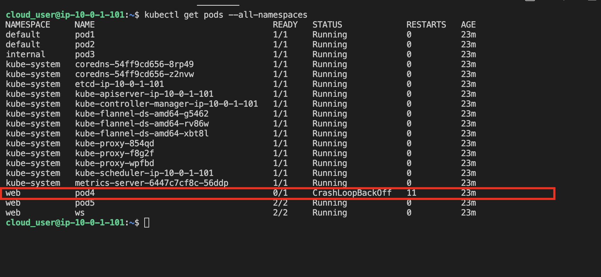

1. SSH into given server

2. Identify the problematic pod in the cluster.
```
kubectl get pods --all-namespaces
```



3. Collect the logs from the pod.
```
kubectl logs <pod_name> -n <namespace_name>
```


4. Output the logs to a file.
```
kubectl logs <pod_name> -n <namespace_name> > broken-pod.log
```

