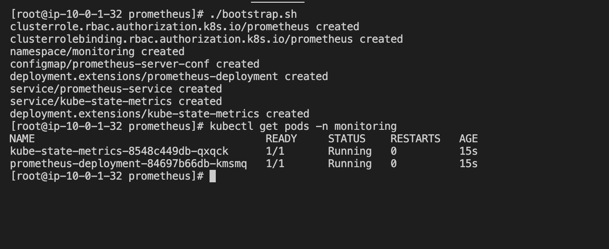
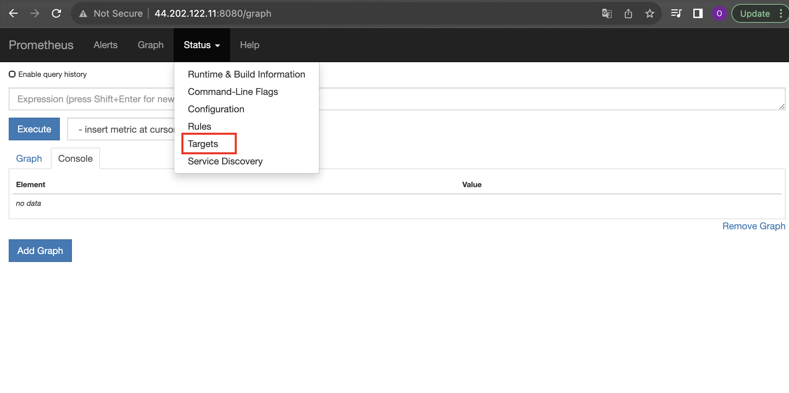
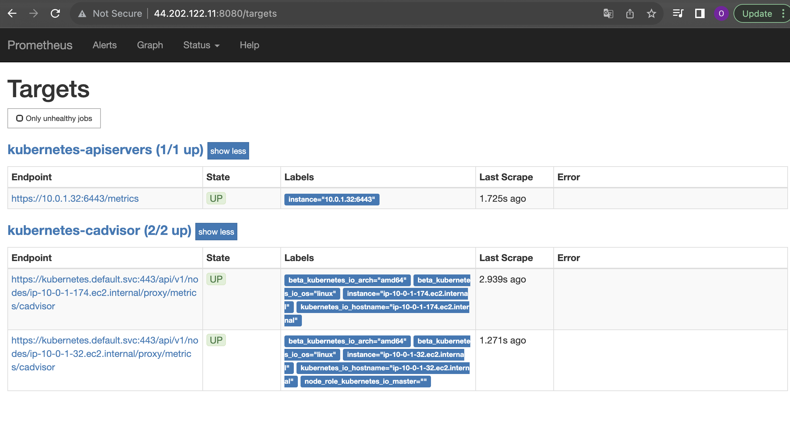

### Logging In and Setting up the Environment

* Log in with SSH to the server.

* Become root user and navigate into `/root/prometheus`. 

* Execute `bootstrap.sh` script, then use `kubectl` to show two running pods.
```
sudo su -
cd /root/prometheus
./bootstrap.sh
kubectl get pods -n monitoring
```



### Configure the Service Discovery Targets

* Edit prometheus-config-map.yml and add in the two service discovery targets
```
vi prometheus-config-map.yml

kubectl apply -f prometheus-config-map.yml
```

### Delete the Prometheus Pod

* List the pods to find the name of the Prometheus pod
```
kubectl get pods -n monitoring
```

* Delete the Prometheus pod
```
kubectl delete pods <POD_NAME> -n monitoring
```

* Validate Prometheus in browser, on port 8080
```
http://<IP>:8080
```

* Click on Status, and select Target from the dropdown. We should see two targets in there.



