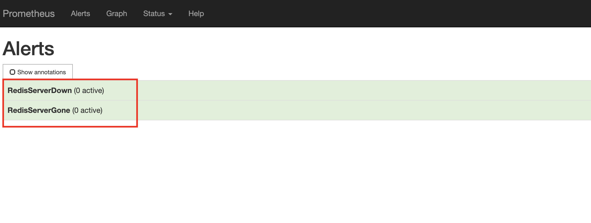

1. Log In and Set up the Environment

* Log in with SSH to the server.

* Become root user and navigate into `/root/prometheus`. 

* Execute `bootstrap.sh` script, then use `kubectl` to show two running pods.
```
sudo su -
cd /root/prometheus
./bootstrap.sh
kubectl get pods -n monitoring
```

2. Create a ConfigMap That Will Be Used to Manage the Alerting Rules

* Edit `prometheus-rules-config-map.yml` and add the Redis alerting rules.

* Apply the changes made to prometheus-rules-config-map.yml
```
kubectl apply -f prometheus-rules-config-map.yml
```

3. Delete the Prometheus Pod

* List the pods to find the name of the Prometheus pod
```
kubectl get pods -n monitoring
```

* Delete the Prometheus pod
```
kubectl delete pods <POD_NAME> -n monitoring
```

* In a new browser tab, navigate to the Expression browser
```
http://<IP>:8080
```

* Click on the Alerts link to verify that the two Redis alerts are showing as green.

