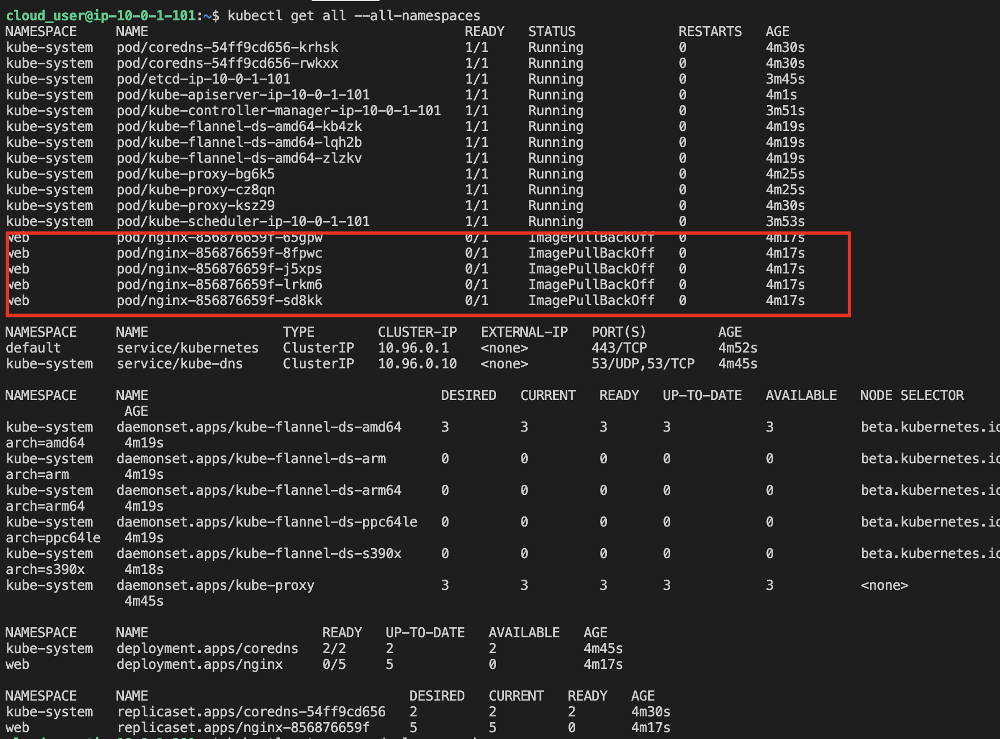
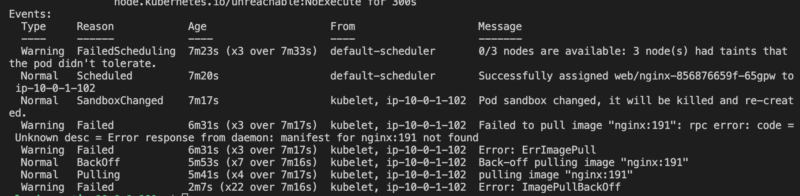
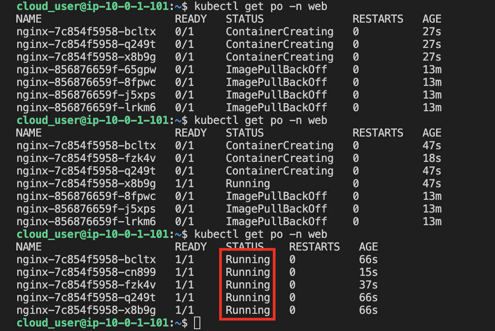
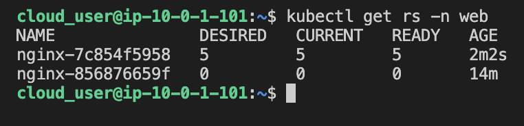
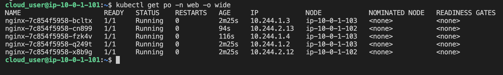
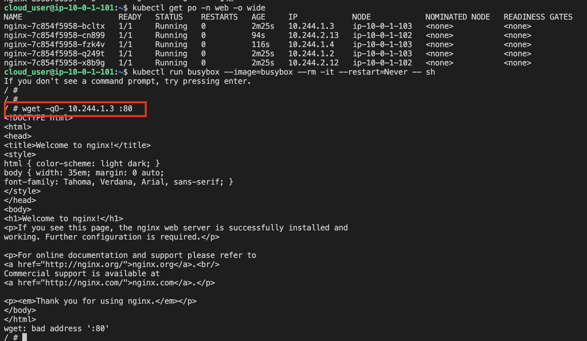

1. Identify the broken pods.
```
kubectl get all --all-namespaces

To make it easier to read, view services, pods, and deployments:

kubectl get svc,po,deploy -n web

```



2. Find out why the pods are broken.
```
kubectl describe pod POD_NAME -n web
```




3. Repair the broken pods, by changing `image: nginx:191` to `image: nginx`
```
kubectl edit deploy nginx -n web
```

4. Verify the repair is complete
```
kubectl get po -n web
```



View the new replica set
```
kubectl get rs -n web
```



5 .Ensure pod health by accessing the pod directly.

* List the pods including the IP addresses
```
kubectl get po -n web -o wide
```



* Start a busybox pod
```
kubectl run busybox --image=busybox --rm -it --restart=Never -- sh
```

* Access the pod directly via its container port, replacing POD_IP_ADDRESS with an appropriate pod IP
```
wget -qO- POD_IP_ADDRESS:80
```


