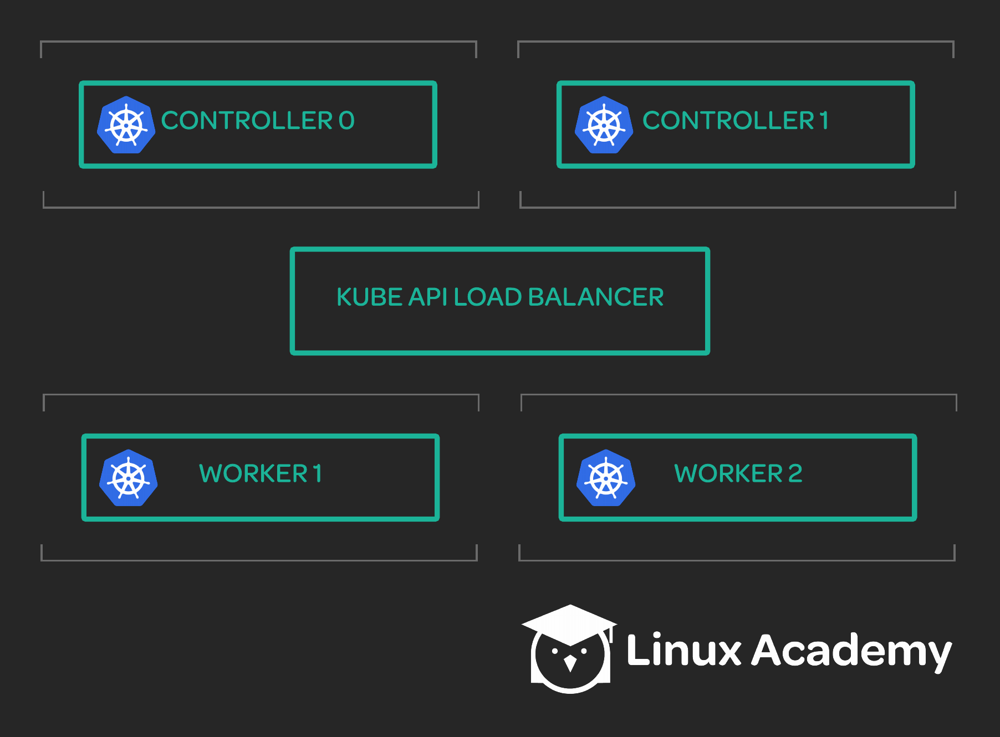

## Scenerio:

Your team is working on setting up a Kubernetes cluster with two controllers and two worker nodes. To enable all the components of Kubernetes to securely authenticate with each other, your team needs to provision a certificate authority and generate several certificates using that authority. Your task is to create the certificate authority and the necessary certificates.

## Tasks:

* Provision the certificate authority (CA).

* Generate the necessary Kubernetes client certs, as well as kubelet client certs for two worker nodes.

* Generate the Kubernetes API server certificate.

* Generate a Kubernetes service account key pair.

## Resources

Here is the cluster architecture for which you will need to generate certificates. Note that these are not real servers, just values that we will use for the purposes of this activity.

* Controllers: 

Hostname: controller0.mylabserver.com, IP: 172.34.0.0 
Hostname: controller1.mylabserver.com, IP: 172.34.0.1

* Workers: 

Hostname: worker0.mylabserver.com, IP: 172.34.1.0 
Hostname: worker1.mylabserver.com, IP: 172.34.1.1

* Kubernetes API Load Balancer: 

Hostname: kubernetes.mylabserver.com, IP: 172.34.2.0

## Notes:

1. CA (Cerificate Authority) is a normal certificate used to sign other certificate, and differrent k8s components uses CA to determine if a certificate created is genuine

* csr --> certificate signing request

* {cert}-key.pem --> private key

* {cert}.pem ---> public key 

2. Client Certifiactes: are certificates used for authentication, basically use for same purpose as a password  (its a more secure version of a password)

3. K8s API server certificate: This is a TLS certificate, that allows different k8s component to access the k8s API securely over HTTPS

4. K8s Service Account key-pair: is a certificate used to sign service account tokens for k8s service accounts.

