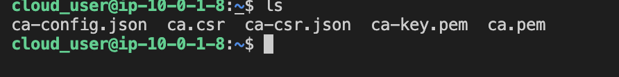
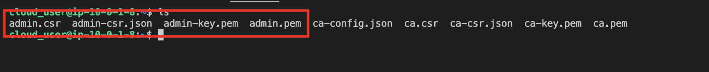
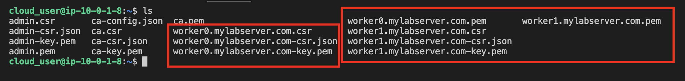
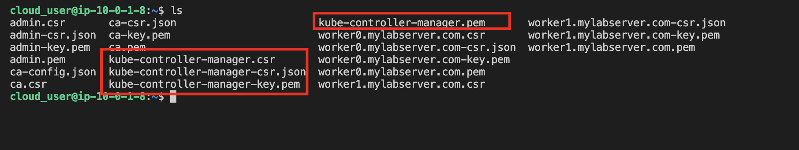
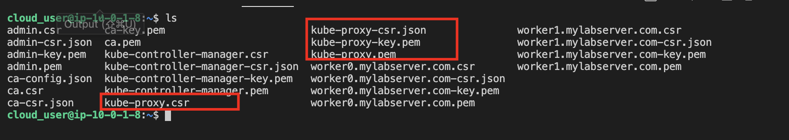
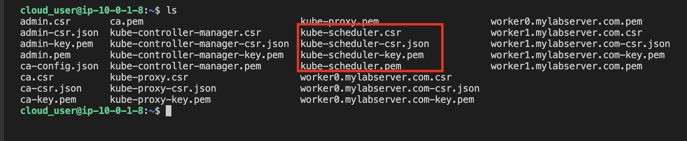
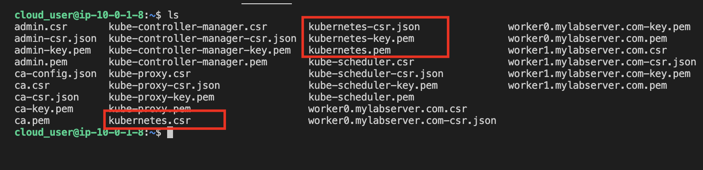
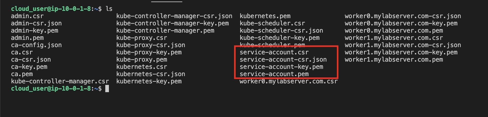

### Note: The Workspace server already has cfssl installed

## Provision the Certificate Authority (CA)

* Provision the certificate authority
```
{

cat > ca-config.json << EOF
{
  "signing": {
    "default": {
      "expiry": "8760h"
    },
    "profiles": {
      "kubernetes": {
        "usages": ["signing", "key encipherment", "server auth", "client auth"],
        "expiry": "8760h"
      }
    }
  }
}
EOF

cat > ca-csr.json << EOF
{
  "CN": "Kubernetes",
  "key": {
    "algo": "rsa",
    "size": 2048
  },
  "names": [
    {
      "C": "US",
      "L": "Portland",
      "O": "Kubernetes",
      "OU": "CA",
      "ST": "Oregon"
    }
  ]
}
EOF

cfssl gencert -initca ca-csr.json | cfssljson -bare ca

}
```

* List the contents of the home directory to view the certificate authority files created
```
ls
```



## Generate the Kubernetes Client Certificates and Kubelet Client Certificates for Two Worker Nodes

* Generate the Admin Client Certificate
```
{

cat > admin-csr.json << EOF
{
  "CN": "admin",
  "key": {
    "algo": "rsa",
    "size": 2048
  },
  "names": [
    {
      "C": "US",
      "L": "Portland",
      "O": "system:masters",
      "OU": "Kubernetes The Hard Way",
      "ST": "Oregon"
    }
  ]
}
EOF

cfssl gencert \
  -ca=ca.pem \
  -ca-key=ca-key.pem \
  -config=ca-config.json \
  -profile=kubernetes \
  admin-csr.json | cfssljson -bare admin

}
```

* List the contents of the home directory to view the admin certificate files created
```
ls
```



* Generate the Kubelet Client Certificates
```
{
cat > worker0.mylabserver.com-csr.json << EOF
{
  "CN": "system:node:worker0.mylabserver.com",
  "key": {
    "algo": "rsa",
    "size": 2048
  },
  "names": [
    {
      "C": "US",
      "L": "Portland",
      "O": "system:nodes",
      "OU": "Kubernetes The Hard Way",
      "ST": "Oregon"
    }
  ]
}
EOF

cfssl gencert \
  -ca=ca.pem \
  -ca-key=ca-key.pem \
  -config=ca-config.json \
  -hostname=172.34.1.0,worker0.mylabserver.com \
  -profile=kubernetes \
  worker0.mylabserver.com-csr.json | cfssljson -bare worker0.mylabserver.com

cat > worker1.mylabserver.com-csr.json << EOF
{
  "CN": "system:node:worker1.mylabserver.com",
  "key": {
    "algo": "rsa",
    "size": 2048
  },
  "names": [
    {
      "C": "US",
      "L": "Portland",
      "O": "system:nodes",
      "OU": "Kubernetes The Hard Way",
      "ST": "Oregon"
    }
  ]
}
EOF

cfssl gencert \
  -ca=ca.pem \
  -ca-key=ca-key.pem \
  -config=ca-config.json \
  -hostname=172.34.1.1,worker1.mylabserver.com \
  -profile=kubernetes \
  worker1.mylabserver.com-csr.json | cfssljson -bare worker1.mylabserver.com

}
```

* List the contents of the home directory to view the kubelet client certificate files created
```
ls
```



## Generate the Kube-Controller-Manager Client Certificate

* Generate the client certificate for the kube-controller-manager
```
{

cat > kube-controller-manager-csr.json << EOF
{
  "CN": "system:kube-controller-manager",
  "key": {
    "algo": "rsa",
    "size": 2048
  },
  "names": [
    {
      "C": "US",
      "L": "Portland",
      "O": "system:kube-controller-manager",
      "OU": "Kubernetes The Hard Way",
      "ST": "Oregon"
    }
  ]
}
EOF

cfssl gencert \
  -ca=ca.pem \
  -ca-key=ca-key.pem \
  -config=ca-config.json \
  -profile=kubernetes \
  kube-controller-manager-csr.json | cfssljson -bare kube-controller-manager

}
```

* List the contents of the home directory to view the kube-controller-manager certificate files created
```
ls
```



## Generate the Kube-Proxy Client Certificate

* Generate the client certificate for the kube-proxy
```
{

cat > kube-proxy-csr.json << EOF
{
  "CN": "system:kube-proxy",
  "key": {
    "algo": "rsa",
    "size": 2048
  },
  "names": [
    {
      "C": "US",
      "L": "Portland",
      "O": "system:node-proxier",
      "OU": "Kubernetes The Hard Way",
      "ST": "Oregon"
    }
  ]
}
EOF

cfssl gencert \
  -ca=ca.pem \
  -ca-key=ca-key.pem \
  -config=ca-config.json \
  -profile=kubernetes \
  kube-proxy-csr.json | cfssljson -bare kube-proxy

}
```

* List the contents of the home directory to view the kube-proxy certificate files created
```
ls
```



## Generate the Kube-Scheduler Client Certificate

* Generate the client certificate for the kube-scheduler
```
{

cat > kube-scheduler-csr.json << EOF
{
  "CN": "system:kube-scheduler",
  "key": {
    "algo": "rsa",
    "size": 2048
  },
  "names": [
    {
      "C": "US",
      "L": "Portland",
      "O": "system:kube-scheduler",
      "OU": "Kubernetes The Hard Way",
      "ST": "Oregon"
    }
  ]
}
EOF

cfssl gencert \
  -ca=ca.pem \
  -ca-key=ca-key.pem \
  -config=ca-config.json \
  -profile=kubernetes \
  kube-scheduler-csr.json | cfssljson -bare kube-scheduler

}
```

* List the contents of the home directory to view the kube-scheduler certificate files created
```
ls
```



## Generate the Kubernetes API Server Certificate

* Generate the Kubernetes API server certificate
```
{

cat > kubernetes-csr.json << EOF
{
  "CN": "kubernetes",
  "key": {
    "algo": "rsa",
    "size": 2048
  },
  "names": [
    {
      "C": "US",
      "L": "Portland",
      "O": "Kubernetes",
      "OU": "Kubernetes The Hard Way",
      "ST": "Oregon"
    }
  ]
}
EOF

cfssl gencert \
  -ca=ca.pem \
  -ca-key=ca-key.pem \
  -config=ca-config.json \
  -hostname=10.32.0.1,172.34.0.0,controller0.mylabserver.com,172.34.0.1,controller1.mylabserver.com,172.34.2.0,kubernetes.mylabserver.com,127.0.0.1,localhost,kubernetes.default \
  -profile=kubernetes \
  kubernetes-csr.json | cfssljson -bare kubernetes

}
```

* List the contents of the home directory to view the Kubernetes API server certificate files created
```
ls
```



## Generate a Kubernetes Service Account Key Pair

* Generate a Kubernetes service account key pair
```
{

cat > service-account-csr.json << EOF
{
  "CN": "service-accounts",
  "key": {
    "algo": "rsa",
    "size": 2048
  },
  "names": [
    {
      "C": "US",
      "L": "Portland",
      "O": "Kubernetes",
      "OU": "Kubernetes The Hard Way",
      "ST": "Oregon"
    }
  ]
}
EOF

cfssl gencert \
  -ca=ca.pem \
  -ca-key=ca-key.pem \
  -config=ca-config.json \
  -profile=kubernetes \
  service-account-csr.json | cfssljson -bare service-account

}
```

* List the contents of the home directory to view the service account key pair files created
```
ls
```

