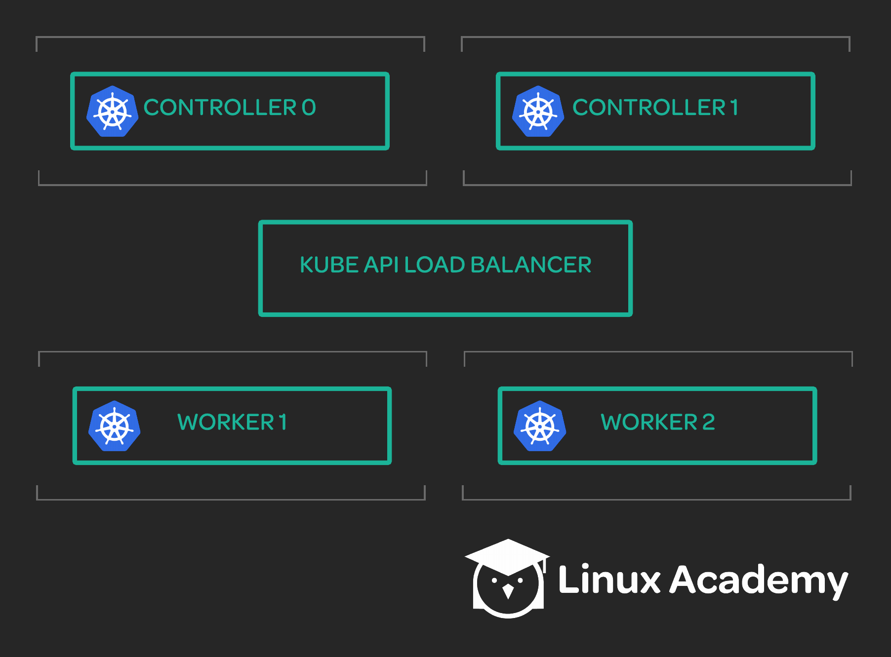

## Scenerio:

Your team is setting up a new Kubernetes cluster with two controllers and two worker nodes. The team has already created a set of client certificates to allow different components of the cluster to authenticate, but they need a set of kubeconfig files to be created using these certificates. Your task is to generate the kubeconfig files that will be used to set up the Kubernetes cluster.

## Task:

The following kubeconfig files need to be created:

* Kubelet (one kubeconfig for each worker node)

* Kube-proxy

* Kube-controller-manager

* Kube-scheduler

* Admin

## Resources:

Here is the cluster architecture. Note that these are not real servers, just values that we will use for the purposes of this activity.

1. Controllers

* Hostname: controller0.mylabserver.com, IP: 172.34.0.0

* Hostname: controller1.mylabserver.com, IP: 172.34.0.1

2. Workers

* Hostname: worker0.mylabserver.com, IP: 172.34.1.0

* Hostname: worker1.mylabserver.com, IP: 172.34.1.1

3. Kubernetes API Load Balancer:

* Hostname: kubernetes.mylabserver.com, IP: 172.34.2.0

* Notes:

Client certificates have already been created. They can be found in `/home/cloud_user` on the workspace server.

The kubelet and kube-proxy services will access the Kubernetes API through the Kubernetes API load balancer. All other services can access it locally at `https://127.0.0.1:6443`.

