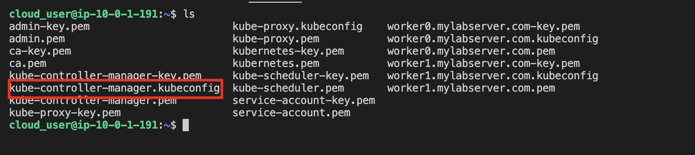

## Generate Kubelet Kubeconfigs for Each Worker Node

1. View the certificates and keys we will use to generate our kubeconfig files in the home dir: `ls`

2. Set an environment variable called `KUBERNETES_PUBLIC_ADDRESS` to the IP address of the load balancer:
```
KUBERNETES_PUBLIC_ADDRESS=172.34.2.0
```

3. Generate the kubeconfigs for the worker nodes
```
for instance in worker0.mylabserver.com worker1.mylabserver.com; do
  kubectl config set-cluster kubernetes-the-hard-way \
    --certificate-authority=ca.pem \
    --embed-certs=true \
    --server=https://${KUBERNETES_PUBLIC_ADDRESS}:6443 \
    --kubeconfig=${instance}.kubeconfig

  kubectl config set-credentials system:node:${instance} \
    --client-certificate=${instance}.pem \
    --client-key=${instance}-key.pem \
    --embed-certs=true \
    --kubeconfig=${instance}.kubeconfig

  kubectl config set-context default \
    --cluster=kubernetes-the-hard-way \
    --user=system:node:${instance} \
    --kubeconfig=${instance}.kubeconfig

  kubectl config use-context default --kubeconfig=${instance}.kubeconfig
done
```

4. Verify the kubeconfig files created: `ls`


## Generate a Kube-Proxy Kubeconfig

1. Generate a kubeconfig for kube-proxy
```
{
  kubectl config set-cluster kubernetes-the-hard-way \
    --certificate-authority=ca.pem \
    --embed-certs=true \
    --server=https://${KUBERNETES_PUBLIC_ADDRESS}:6443 \
    --kubeconfig=kube-proxy.kubeconfig

  kubectl config set-credentials system:kube-proxy \
    --client-certificate=kube-proxy.pem \
    --client-key=kube-proxy-key.pem \
    --embed-certs=true \
    --kubeconfig=kube-proxy.kubeconfig

  kubectl config set-context default \
    --cluster=kubernetes-the-hard-way \
    --user=system:kube-proxy \
    --kubeconfig=kube-proxy.kubeconfig

  kubectl config use-context default --kubeconfig=kube-proxy.kubeconfig
}
```

2. Verify the kubeconfig files created: `ls`


## Generate a Kube-Controller-Manager Kubeconfig

1. Generate a kubeconfig for the kube-controller-manager
```
{
  kubectl config set-cluster kubernetes-the-hard-way \
    --certificate-authority=ca.pem \
    --embed-certs=true \
    --server=https://127.0.0.1:6443 \
    --kubeconfig=kube-controller-manager.kubeconfig

  kubectl config set-credentials system:kube-controller-manager \
    --client-certificate=kube-controller-manager.pem \
    --client-key=kube-controller-manager-key.pem \
    --embed-certs=true \
    --kubeconfig=kube-controller-manager.kubeconfig

  kubectl config set-context default \
    --cluster=kubernetes-the-hard-way \
    --user=system:kube-controller-manager \
    --kubeconfig=kube-controller-manager.kubeconfig

  kubectl config use-context default --kubeconfig=kube-controller-manager.kubeconfig
}
```

2. Verify the kubeconfig files created: `ls`



## Generate a Kube-Scheduler Kubeconfig

1. Generate a kubeconfig for kube-scheduler
```
{
  kubectl config set-cluster kubernetes-the-hard-way \
    --certificate-authority=ca.pem \
    --embed-certs=true \
    --server=https://127.0.0.1:6443 \
    --kubeconfig=kube-scheduler.kubeconfig

  kubectl config set-credentials system:kube-scheduler \
    --client-certificate=kube-scheduler.pem \
    --client-key=kube-scheduler-key.pem \
    --embed-certs=true \
    --kubeconfig=kube-scheduler.kubeconfig

  kubectl config set-context default \
    --cluster=kubernetes-the-hard-way \
    --user=system:kube-scheduler \
    --kubeconfig=kube-scheduler.kubeconfig

  kubectl config use-context default --kubeconfig=kube-scheduler.kubeconfig
}
```

2. Verify the kubeconfig files created: `ls`


## Generate an Admin Kubeconfig

1. Generate a kubeconfig for the admin user
```
{
  kubectl config set-cluster kubernetes-the-hard-way \
    --certificate-authority=ca.pem \
    --embed-certs=true \
    --server=https://127.0.0.1:6443 \
    --kubeconfig=admin.kubeconfig

  kubectl config set-credentials admin \
    --client-certificate=admin.pem \
    --client-key=admin-key.pem \
    --embed-certs=true \
    --kubeconfig=admin.kubeconfig

  kubectl config set-context default \
    --cluster=kubernetes-the-hard-way \
    --user=admin \
    --kubeconfig=admin.kubeconfig

  kubectl config use-context default --kubeconfig=admin.kubeconfig
}
```

2. Verify the kubeconfig files created: `ls`

