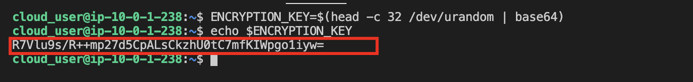
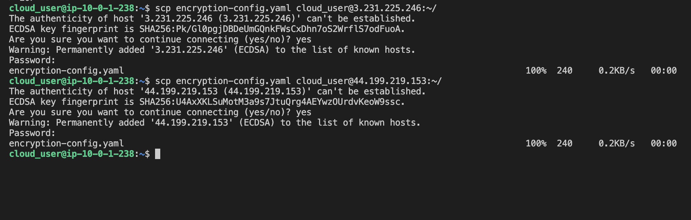

1. Login to the workspace server.

2. Generate an Encryption Key and Include It in a Kubernetes Data Encryption Config File

* Generate the random string we'll use for our encryption key
```
ENCRYPTION_KEY=$(head -c 32 /dev/urandom | base64)
```

* View the random string generated
```
echo $ENCRYPTION_KEY
```



* Generate the config file
```
cat > encryption-config.yaml << EOF
kind: EncryptionConfig
apiVersion: v1
resources:
  - resources:
      - secrets
    providers:
      - aescbc:
          keys:
            - name: key1
              secret: ${ENCRYPTION_KEY}
      - identity: {}
EOF
```

3. Copy the File to the Kubernetes Controller Servers

* Copy the `encryption-config.yaml` to the Controller Server 0
```
scp encryption-config.yaml cloud_user@<CONTROLLER0_PUBLIC_IP>:~/
```

* Copy the `encryption-config.yaml` to the Controller Server 1
```
scp encryption-config.yaml cloud_user@<CONTROLLER1_PUBLIC_IP>:~/
```

