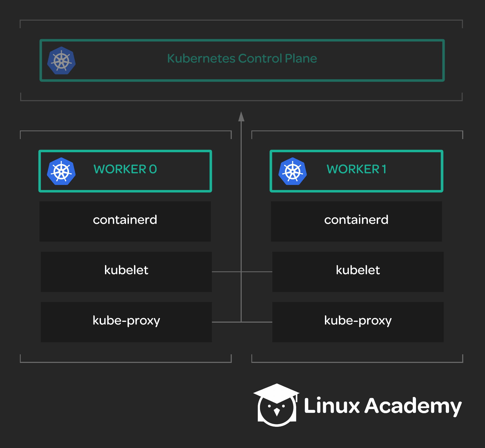

## Scenerio:

Your team wants to set up a new Kubernetes cluster. Control nodes have already been created and are ready to be used. However, no worker nodes have been set up. You have been given the task of setting up two worker nodes to be used as part of the new Kubernetes cluster.

## Tasks:

* Install the required packages.

* Download and install the necessary binaries.

* Configure the containerd service.

* Configure the kubelet service.

* Configure the kube-proxy service.

* Successfully start all of the services.

