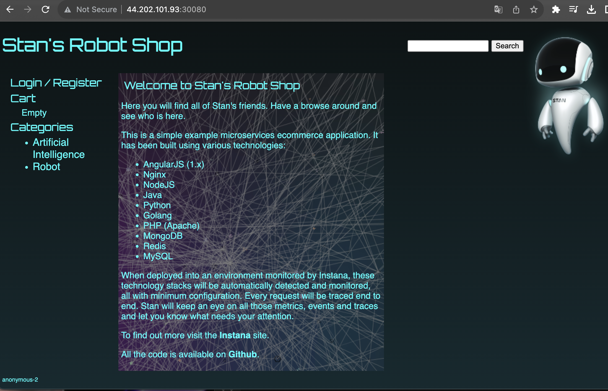

## Deploy the Stan's Robot Shop app to the cluster

1. Clone the Git repo that containing pre-made descriptors
```
cd ~/
git clone https://github.com/linuxacademy/robot-shop.git
```
2. Create a separate namespace for the application
```
kubectl create namespace robot-shop
```

3. Deploy the app to the cluster
```
kubectl -n robot-shop create -f ~/robot-shop/K8s/descriptors/
```

4. Check the status of the application's pods
```
kubectl get pods -n robot-shop

To watch the containers being created:

kubectl get pods -n robot-shop -w
```
5. Validate deployment in your browser
```
http://$kube_master_public_ip:30080
```



## Scale up the MongoDB deployment to two replicas instead of just one

1. Edit the deployment descriptor
```
kubectl edit deployment mongodb -n robot-shop
```

* You should see some YAML describing the deployment object.

* Under `spec:`, change `replicas:` from 1 to 2.

* Save and exit.

2. Check the status of the deployment with
```
kubectl get deployment mongodb -n robot-shop
```